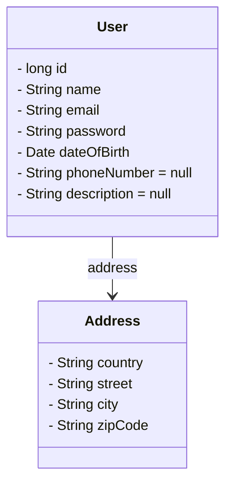
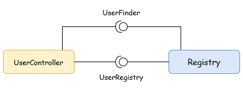

# Supralog technical test

This application allows to register users and to display the details of a registered user. The detailed subject can be found inside the [doc directory](doc/TestTechnique_JAVA_BACK_END[736].pdf).


## Table of contents
* [Requirements](#requirements)
* [How to launch the project](#how-to-launch-the-project)
* [Architecture and Conception](#architecture-and-conception)
* [Potential improvements](#potential-improvements)


## Contributor
* Gabriel Cogne

## Requirements
* [Java Development Kit 21+](https://www.oracle.com/fr/java/technologies/downloads/)
* [Maven](https://maven.apache.org/download.cgi)

* [Docker](https://www.docker.com/) which is optionally if MongoDB is installed

This project uses [Spring Boot](https://spring.io/projects/spring-boot) framework along with [MongoDB](https://www.mongodb.com).

## How to launch the project
With Docker, which will also run the database, you can use the following command:
```zsh
docker-compose up
```

> :warning: If you use Docker, you may need to use `docker-compose down` to shut down and delete the running container.


Without Docker, you can use `./mvnw` to run the project using the following command:
```zsh
./mvnw clean spring-boot:run
```
Also, inside the [src/main/resources/application.properties](src/main/resources/application.properties) file, you will
need to change `spring.data.mongodb.host` from `database` to `localhost`.

Once the application is launched, you can connect to [http://localhost:8080/swagger-ui/index.html](http://localhost:8080/swagger-ui/index.html)
to access the REST API documentation.

## Architecture and Conception
### 1. Business objects
The first thing to do is to define what are our data. So what's attribute should have our user?

As only adult people who live in France can have an account, we need at least their dateOfBirth, their address, an email,
so they can be authenticated, and eventually a password. A user should also be able to fill in his name or a nickname.
As optional parameter we could ask for the user phone number or a short description of himself



### 2. REST API
#### Register a user
##### Route
```
POST /users/register?unfold=false
```
##### Parameters
* `unfold` If true, returns user details, otherwise, it returns its id. Default value is false
##### Accepted data type
```json
{
  "email": "",
  "name": "",
  "password": "encryptedPassword",
  "dateOfBirth": "2022-06-06",
  "address": {
	"country": "",
	"city": "",
	"street": "",
	"zipCode": ""
  },
  "phoneNumber": null,
  "description": null
}
```
##### Return type
On success, the call should return with the http code `CREATED` (201).
If `unfold` is set to `true`, it will return this:
```json
{
  "id": 0,
  "email": "",
  "name": "",
  "dateOfBirth": "2022-06-06",
  "address": {
	"country": "",
	"city": "",
	"street": "",
	"zipCode": ""
  },
  "phoneNumber": null,
  "description": null
}
```
Otherwise, it will return the user ID.

##### Potential errors
If the person is not an adult, or it doesn't live in France, the call should
return `BAD_REQUEST` (400).

If the email to be registered belongs to a user inside the database, the call should
return `CONFLICT` ().

#### Get a user details
#### Route
```
GET /users/{id}
```
##### Parameters
* `id` describe the user we want to see
##### Return type
```json
{
  "id": 0,
  "email": "",
  "name": "",
  "dateOfBirth": "2022-06-06",
  "address": {
	"country": "",
	"city": "",
	"street": "",
	"zipCode": ""
  },
  "phoneNumber": null,
  "description": null
}
```
##### Potential errors
The response should be `NOT_FOUND` (404) if the users is not known by the system.


#### 3. Interfaces and Components
```java
interface UserRegistry {
    int registerUser(User user);
}

interface UserFinder {
    User getUser(int id);
}
```
##### Component diagram


As the application only manages users, we could have one component that implements
both interfaces (use registry and the user detail finder) along with one controller.

## Potential improvements
Validation is only performed on the user's email. Validation should cover each field and prevent any possible injection.

A user's data should only be sent to him or her, or the system must ask his or her permission before sending it to another person.