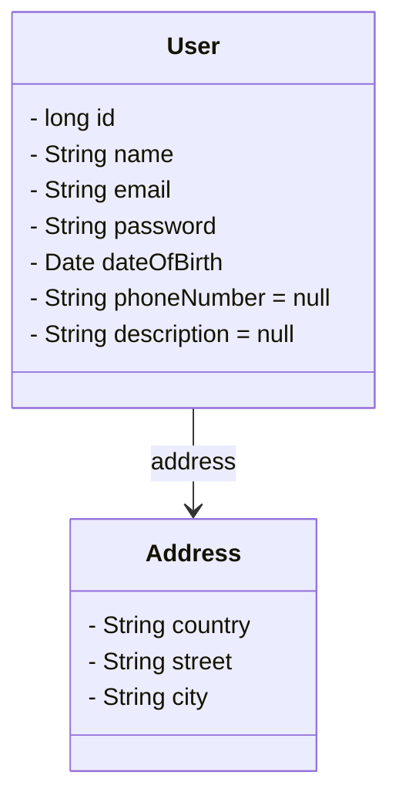

# Supralog technical test

This application allows to register users and to display the details of a registered user. The detailed subject can be found inside the [doc directory](doc/TestTechnique_JAVA_BACK_END[736].pdf).


## Table of contents
* [Requirements](#requirements)
* [How to launch the project](#how-to-launch-the-project)
* [Architecture and Conception](#architecture-and-conception)


## Contributor
* Gabriel Cogne

## Requirements
* [Java Development Kit 21+](https://www.oracle.com/fr/java/technologies/downloads/)
* [Maven](https://maven.apache.org/download.cgi)

This project uses [Spring Boot](https://spring.io/projects/spring-boot) framework.

## How to launch the project
You can either start the project directly using this command :
```zsh
mvnw spring-boot:run
```

Or you can run the test, create a jar file and use it to run the project.
```zsh
# Test and create the jar file
mvn clean package

# Run the jar file
java -jar supralog-technical-test-0.0.1-SNAPSHOT.jar
```

Once the application is launched, you can connect to [http://localhost:8080/](http://localhost:8080) to check the routes

## Architecture and Conception
### 1. Business objects
The first thing to do is to define what are our data. So what's attribute should have our user?

As only adult people who live in France can have an account, we need at least there dateOfBirth, there address, an email,
so they can be authenticated, and eventually a password. A user should also be able to fill in his name or a nickname.
As optional parameter we could ask for the user phone number or a short description of himself



### 2. REST API
#### Register a user
##### Route
```
POST /users/register?unfold=false
```
##### Parameters
* `unfold` If true, returns user details, otherwise, it returns its id. Default value is false
##### Accepted data type
```json
{
  "email": "",
  "name": "",
  "password": "encryptedPassword",
  "dateOfBirth": "2022-06-06",
  "address": {
	"country": "",
	"city": "",
	"street": ""
  },
  "phoneNumber": null,
  "description": null
}
```
##### Return type
On success, the call should return with the http code `CREATED` (201).
If `unfold` is set to `true`, it will return this:
```json
{
  "id": 0,
  "email": "",
  "name": "",
  "dateOfBirth": "2022-06-06",
  "address": {
	"country": "",
	"city": "",
	"street": ""
  },
  "phoneNumber": null,
  "description": null
}
```
Otherwise, it will return the user ID.

##### Potential errors
If the person is not an adult, or it doesn't live in France, the call should
return `BAD_REQUEST` (400).

#### Get a user details
#### Route
```
GET /users/{id}
```
##### Parameters
* `id` describe the user we want to see
##### Return type
```json
{
  "id": 0,
  "email": "",
  "name": "",
  "dateOfBirth": "2022-06-06",
  "address": {
	"country": "",
	"city": "",
	"street": ""
  },
  "phoneNumber": null,
  "description": null
}
```
##### Potential errors
The response should be `NOT_FOUND` (404) if the users is not known by the system.


#### 3. Interfaces and Components
```java
interface UserRegistry {
    int registerUser(User user);
}

interface UserFinder {
    User getUser(int id);
}
```
##### Component diagram


As the application only manages users, we could have one component that implements
both interfaces (use registry and the user detail finder) along with one controller.